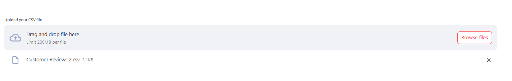
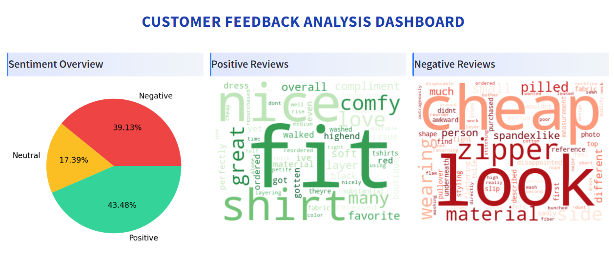
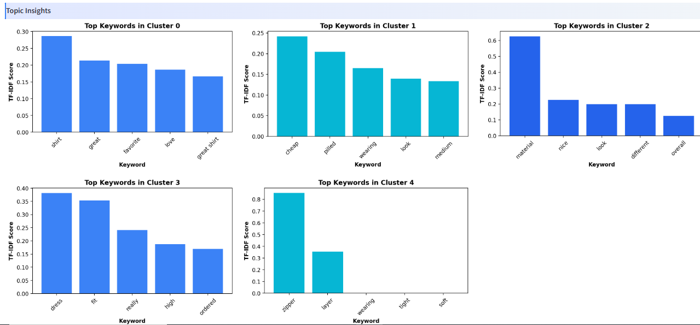
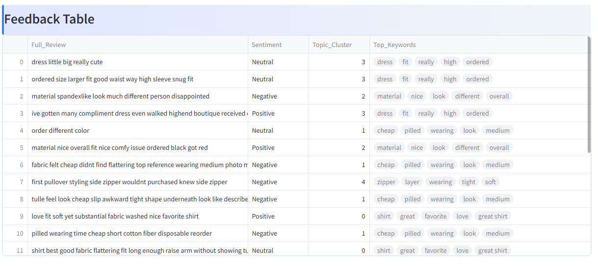

## Project Name: Customer Feedback Analysis Dashboard
The Customer Feedback Analysis Dashboard is an interactive, web-based application built with Streamlit that empowers businesses to analyze and understand customer feedback at scale. 
This project demonstrates the end-to-end workflow of a typical text analytics pipeline, including data preprocessing, handling imbalanced datasets, feature extraction, model training, topic extraction, and dashboard visualization. It is structured to be modular, allowing easy updates to the preprocessing steps, model, or visualization components without affecting the rest of the system.

### Tech Stack:

* Frontend / Dashboard: Streamlit
* Data Processing & Cleaning: Python (Pandas, NumPy, NLTK, regex)
* Feature Extraction & NLP: TF-IDF Vectorizer, Scikit-learn
* Machine Learning: Logistic Regression (for sentiment classification), K-Means (for topic extraction)
* Data Storage / Serialization: Pickle (for saving preprocessor and trained models)
* Visualization: Matplotlib, Seaborn, WordCloud, Streamlit charts/components

### Detailed Description of Workflow:

#### Data Upload and Integration
Users can upload a CSV file containing customer reviews. The application supports files with at least 20 rows and accepts `Full_Review`, `Review`, `Feedback`, `Text`, `tweet_text`, `full_text`, `Comment`, `Body`, or `Message` text columns, including Xquik API exports. This flexibility allows businesses to analyze data from different sources without extra formatting effort.

#### Automated Text Preprocessing
The raw textual data is cleaned and normalized using the preprocessing module. This includes:

- Lowercasing all text to maintain consistency
- Removing punctuation, numbers, and irrelevant symbols
- Eliminating stopwords that do not contribute to sentiment or topic detection
- Lemmatization to reduce words to their base forms

These steps ensure that the input is standardized and suitable for machine learning models, improving both sentiment classification and topic extraction accuracy.

#### Handling Imbalanced Datasets
While training the sentiment model, the original dataset often had an uneven distribution of positive, neutral, and negative reviews. This imbalance was addressed using `RandomUnderSampler`, ensuring that the classifier is not biased towards dominant classes and can accurately detect all sentiment types.

#### Sentiment Classification
The dashboard uses a pre-trained TF-IDF + Logistic Regression pipeline to classify each review into Positive, Neutral, or Negative categories. The TF-IDF vectorizer captures the importance of words in context, while Logistic Regression provides reliable classification.

#### Topic Modeling / Theme Extraction
To uncover underlying themes or topics in the reviews, the system applies K-Means clustering on the TF-IDF vectors. Each cluster represents a recurring topic or theme, and the top keywords in each cluster are extracted and displayed for easier interpretation. This helps businesses quickly identify common concerns, suggestions, or praises.

#### Interactive Visual Insights
The dashboard offers multiple visualizations to communicate insights effectively:

- **Sentiment Overview:** Pie chart showing the proportion of positive, neutral, and negative comments.
- **Topic Insights:** Bar chart highlighting top keywords for each detected theme.
- **Feedback Table:** Interactive table displaying the original review, predicted sentiment, and assigned topic for quick reference.
- **Word Clouds:** Two separate word clouds for the most frequent words in positive and negative reviews, giving a visual summary of customer opinions.

#### Modular and Reusable Architecture
All preprocessing, model training, and prediction logic are abstracted into dedicated modules. This ensures that updates to the model or preprocessing steps can be made independently without affecting the dashboard’s functionality. Pretrained models are stored under `/models/`, making deployment faster and reducing computation requirements for end users.

               
## Project Architecture

1. app.py                         # Main Streamlit dashboard application
2. requirements.txt               # Python dependencies
3. .gitignore                    # Ignored files (venv)

4. data/

    4.1 trc_results.txt           # Cluster names and top keywords for each cluster of training data

5. datasets/

    5.1 Womens Clothing E-Commerce Reviews.csv    # Original dataset from Kaggle for training model

    5.2 Customer Reviews 2.csv                    # Test CSV file for user uploaded in the Streamlit app

6. models/

    6.1 data_processed.pkl        # Dataset with sentiment columns added, redundant columns dropped

    6.2 data_cleaned.pkl          # Dataset after cleaning and lemmatization

    6.3 model.pkl                 # Sentiment classification pipeline

7. modules/
  
     7.1 preprocessing.ipynb       # Notebook for addition of Sentiment columns for supervised learning, dropping redundant columns in the original dataset
     
     7.2 data_processor.py         # Python functions for cleaning and normalizing text
     
     7.3 export_model.ipynb        # Handling imbalanced data, TF-IDF + Logistic Regression pipeline, training/testing, evaluation
     
     7.4 find_topics.py            # TF-IDF + KMeans topic extraction for user-uploaded CSV
    
     7.5 predict.py                # Sentiment prediction logic
     
     7.6 tf_idf.py                 # TF-IDF + KMeans topic extraction for original CSV and cluster keyword file creation
     
     7.7 trc.png                   # Scatterplot of clusters for original dataset

8. venv/                         # Virtual environment (excluded from repo)
